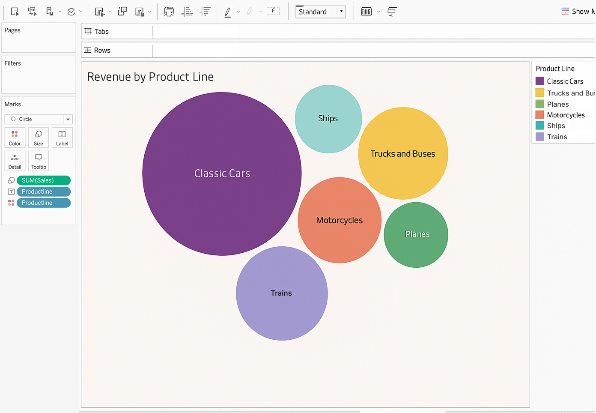

# Sales Analytics Dashboard using SQL and Tableau

 

#  Overview
In this project, I explored a retail sales dataset using SQL Server for querying and Tableau for visualization. The goal was to turn raw transactional data into meaningful dashboards that provide actionable business insights related to revenue trends, customer distribution, product performance, and pricing.

#  Project Description
This project presents a comprehensive Sales Analytics Dashboard built using SQL and Tableau to explore historical sales data and derive actionable business insights. The analysis began by importing the dataset into SQL Server, where various queries were written to examine revenue trends, product performance, deal sizes, and customer distribution across regions and time periods. Using Tableau, the results were transformed into interactive dashboards that offer visual narratives on key business metrics. These dashboards include customer distribution by country, sales trends by product line and year, deal size performance, monthly revenue fluctuations, and price distribution patterns. The visualizations highlight critical insights such as the dominance of medium-sized deals in revenue contribution, the consistent outperformance of product lines like Classic Cars, and the significant sales volume from countries like the USA and France. The combination of SQL-driven data analysis and Tableau’s interactive visualizations makes this project a powerful example of how data can be transformed into strategic intelligence for decision-making.

# Visualizations and Dashboards
## Customer Distribution by Country
Displays customer counts by country. USA, France, and Mexico lead in customer volume.

## Sales by Product Line and Order Year
Shows yearly sales trends per product line. Classic Cars and Vintage Cars generate the highest revenue.

## Revenue by Product Line  
This bubble chart illustrates the revenue contribution of each product line. Classic Cars generate the highest revenue, followed by Trucks and Buses, Motorcycles, and Ships.  

## Price Distribution
Visualizes the price frequency of products. Most items are priced between $25–$35.

#  Conclusion
Key findings show that Classic Cars consistently outperform other product lines, which suggests a strong opportunity for inventory prioritization and targeted marketing. Medium-sized deals contribute the most to overall revenue, indicating a chance to strengthen mid-tier offerings or explore cross-selling within this segment. The USA and France stand out as top-performing markets, making them important regions to focus on for future campaigns or localized promotions.

From a pricing perspective, most products are priced between 25 and 35 dollars, showing that customers are price-sensitive. This insight can help shape pricing strategies for new or underperforming products. Seasonal changes in revenue, seen through monthly trends, can guide how resources are allocated and when promotions should be launched.

By keeping track of key performance indicators such as top-performing product lines, deal size contributions, regional sales, and price ranges, stakeholders can make informed decisions to boost sales, refine customer segmentation, and drive revenue growth.

#  Tools Used
SQL Server Management Studio (SSMS) for querying and data preparation

Tableau for interactive data visualization and dashboard creation

Excel (CSV format) as the data source
